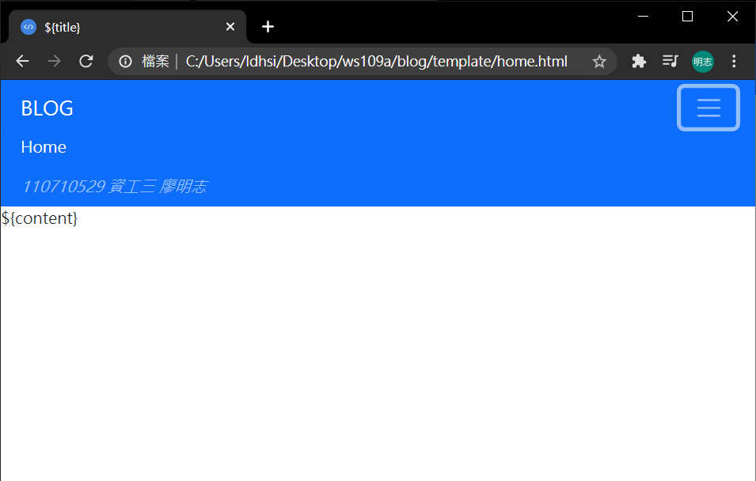
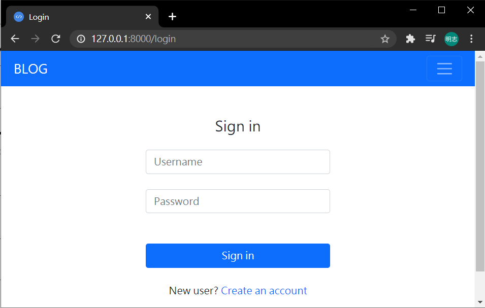
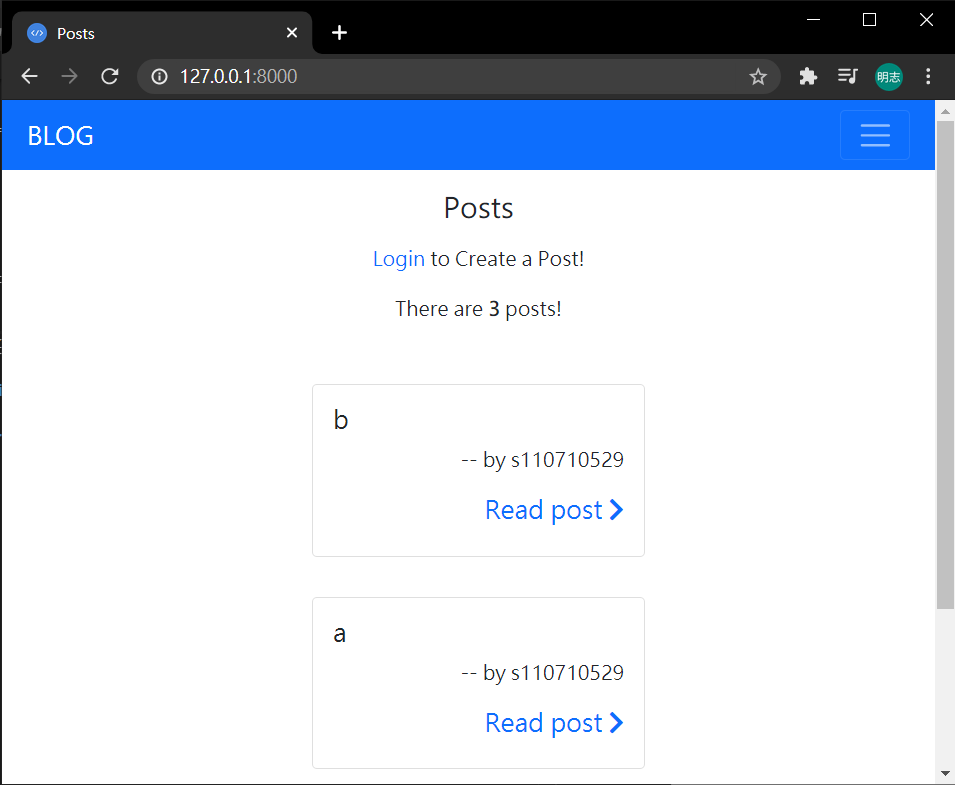
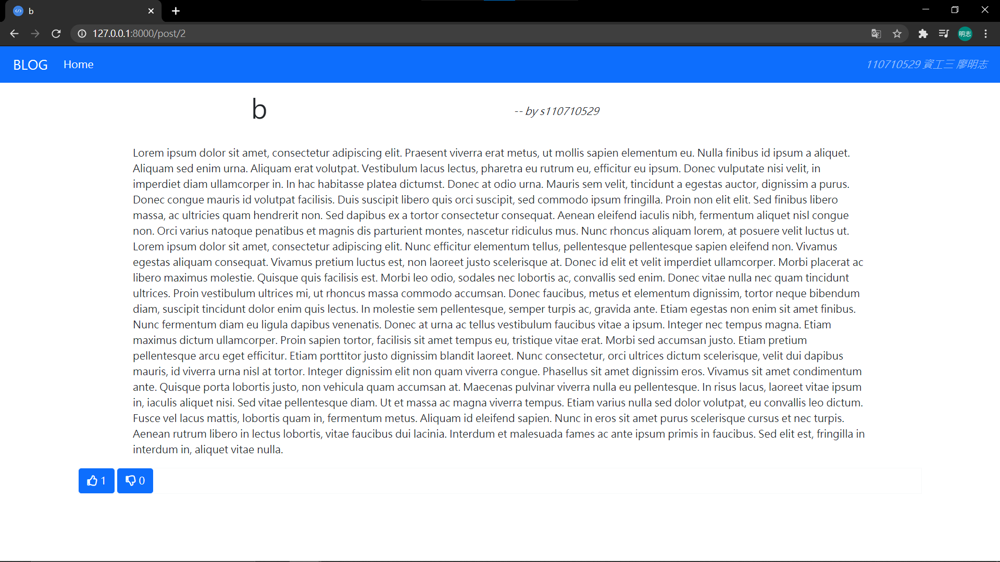
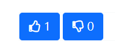
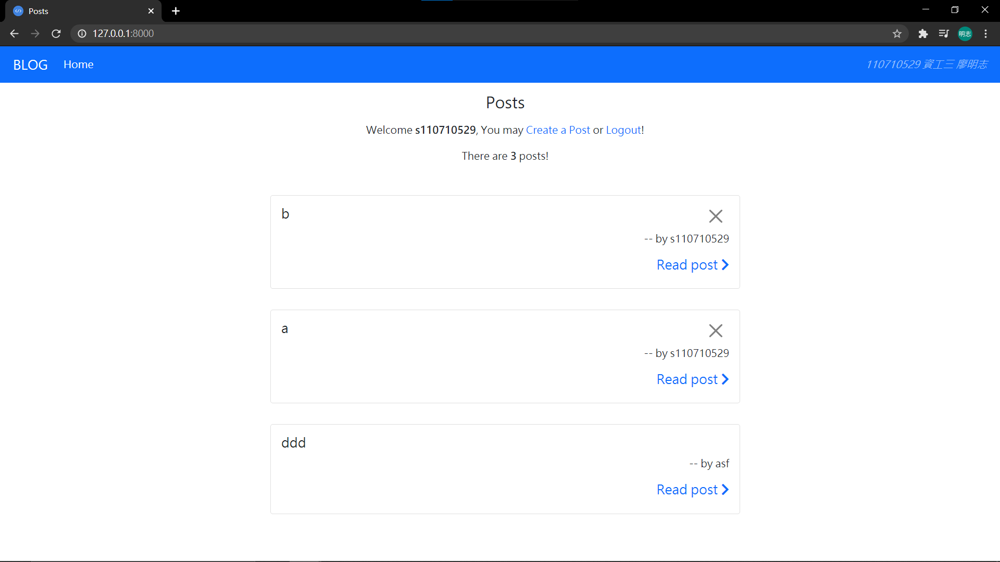

# Blog

- mid term project of web design

- this project is an extension of course sample
  > reference ⇻ [https://gitlab.com/ccc109/ws/-/tree/master/deno/07-session/03-blogSignup](https://gitlab.com/ccc109/ws/-/tree/master/deno/07-session/03-blogSignup)

---

## Contents

1. [prettify origin web page](#Prettify)
2. [add like/dislike comment function](#like--dislike-comment)
3. [add post deleting function](#post-deleting)

- [demo](https://github.com/ArthurLiao0816/ws109a/blob/master/blog/src/demo.mp4)

## [Prettify](#Contents)

- basic genre：

  - navbar
    

  * add header icon

    ```
    <link
        rel="icon"
        href="https://cdn1.iconfinder.com/data/icons/jetflat-multimedia-vol-2/90/004_100_code_tag_brackets_coding_html_development-256.png"
        type="image/icon type"
    />
    ```

  * import bootstrap sources

    ```
    <link
    rel="stylesheet"
    href="https://stackpath.bootstrapcdn.com/bootstrap/5.0.0-alpha2/css/bootstrap.min.css"
    integrity="sha384-DhY6onE6f3zzKbjUPRc2hOzGAdEf4/Dz+WJwBvEYL/lkkIsI3ihufq9hk9K4lVoK"
    crossorigin="anonymous"
    />
    <script
    type="text/javascript"
    src="https://www.gstatic.com/charts/loader.js"
    ></script>
    <script
    src="https://stackpath.bootstrapcdn.com/bootstrap/5.0.0-alpha2/js/bootstrap.bundle.min.js"
    integrity="sha384-BOsAfwzjNJHrJ8cZidOg56tcQWfp6y72vEJ8xQ9w6Quywb24iOsW913URv1IS4GD"
    crossorigin="anonymous"
    ></script>
    ```

  * import fontawesome

    ```
    <script src="https://kit.fontawesome.com/a076d05399.js"></script>

    ```

* loginUI
  

* signupUI
  

* home page
  

* post reading page
  

## [Like / Dislike comment](#Contents)

- function name
  ```
  async function comment(ctx){
      ...
  }
  ```

* feature
  1. if you've not login while click like/dislike button, this web will direct you to login page.
  2. After users login, the like/dislike button will show the current number of like/dislike.
  3. like/dislike button behavior：
     ```
     null       -> like：   (likeNum+1)    (update)
     null       -> like：   (dislikeNum+1) (update)
     dislike    -> like：   (dislikeNum-1) (likeNum+1)    (update)
     like       -> dislike：(likeNum-1)    (dislikeNum+1) (update)
     like       -> like：   (likeNum-1)    (delete)
     dislike    -> dislike：(dislikeNum-1) (delete)
     ```

- database usage

  - add two attributes `like_num`, `dislike_num` to datatable `posts`

  * add new datatable `like` to store each user's like status to each post

- code ( mostly in main.js )

  - add `.post("/post/:id", comment)` to `router`

  * direct to login page if the user hasn't login

    ```
    let users = await ctx.state.session.get("user");
    if (users != null) {
        ...
    } else {
        ctx.response.body = render.loginUi();
    }
    ```

  - check user's like history status to the current post, if user hasn't leave any comment to the post, create a new one to `like` datatable

    ```
    let users = await ctx.state.session.get("user");
    let user = users.username;
    let user_like = sqlcmd(
      `SELECT likes FROM like WHERE postid=(?) and username=(?)`,
      [pid, user]
    );
    let userLike;
    for (const [likes] of user_like) {
      userLike = likes;
    }
    console.log(`userLike-> `, userLike);
    if (userLike === undefined) {
      sqlcmd("INSERT INTO like (username, postid) VALUES (?, ?)", [user, pid]);
    }
    ```

  - check current post like status
    ```
    let posts = db.query(
      "SELECT like_num, dislike_num FROM posts WHERE id=" + pid
    );
    let likeNum, dislikeNum;
    for (const [like_num, dislike_num] of posts) {
      likeNum = like_num;
      dislikeNum = dislike_num;
    }
    ```

  * check which button did user click, like/dislike
    ```
    if (post.btndislike != null) {
        ...
    } else {
        ...
    }
    ```
  * if user clike dislike button, do what `like/dislike button behavior` says

    ```
    if (userLike === "dislike") {
        dislikeNum -= 1;
        sqlcmd(`DELETE FROM like WHERE username=(?) AND postid=(?)`, [
            user,
            pid,
        ]);
    } else {
        if (userLike === "like") {
            likeNum -= 1;
            dislikeNum += 1;
        }
        if (userLike === undefined) dislikeNum += 1;
        sqlcmd(
            `UPDATE like SET likes = (?) WHERE username=(?) and postid=(?)`,
            [post.btndislike, user, pid]
        );
    }
    ```

  * if user clike like button, do what `like/dislike button behavior` says
    ```
    if (userLike === "like") {
        console.log("like -> like");
        likeNum -= 1;
        sqlcmd(`DELETE FROM like WHERE username=(?) AND postid=(?)`, [
            user,
            pid,
        ]);
    } else {
        if (userLike === "dislike") {
            console.log("dislike -> like");
            dislikeNum -= 1;
            likeNum += 1;
        }
        if (userLike === undefined) {
            console.log("null -> like");
            likeNum += 1;
        }
        sqlcmd(
            `UPDATE like SET likes = (?) WHERE username=(?) and postid=(?)`,
            [post.btnlike, user, pid]
        );
    }
    ```
  * update the current post status, then refresh the page
    ```
    sqlcmd("UPDATE posts SET like_num =(?), dislike_num =(?) WHERE id=(?)", [
      likeNum,
      dislikeNum,
      pid,
    ]);
    ctx.response.redirect("/post/" + pid);
    ```

- simple demo ( really simple, hum ( •̀ ω •́ )✧

  

## [Post Deleting](#Contents)

- function name

  ```
  async function del(ctx){
      ...
  }
  ```

- feature
  1. delete specific post
  2. delete user like status to that specific post
  3. only the user who create the target post could delete it

* code ( mostly in main.js )
  - add `.post("/del/:id", del);` to `router`
  * delete specific post from database along with it's related data in datatable `like`
    ```
    const pid = ctx.params.id;
    var user = await ctx.state.session.get("user");
    sqlcmd(`DELETE FROM like WHERE postid=(?)`, [pid]);
    sqlcmd(`DELETE FROM posts WHERE id=(?)`, [pid]);
    ctx.response.redirect("/");
    ```
  * ( in render.js ) only generate delete button when current user is the same as user post the target post
    ```
    ${
        user != null
            ? user.username == post.username
                ? '<div class="col-1"><button type="submit" class="btn-close" aria-label="Close"></button></div>'
                : ""
        : ""
    }
    ```
* simple demo
  
